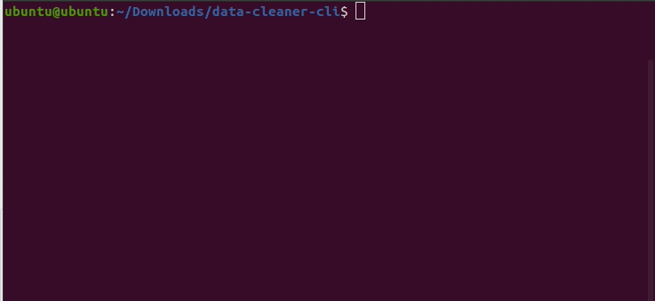

# data-cleaner-cli
---

This project is a simple CLI tool made in python with the package [click](https://click.palletsprojects.com/en/8.0.x/#). You can install the necessary componentes running `make install`

The goal was just to make some exploratory analsys with a jupyter notebook and then export it to a python script, using the command: `make lint` get some feedback from the [pylint package](https://pylint.org/). This was also a lesson about good practices and documentation.

## the tool
---

The tool makes all processing in the dataset described in the notebook, then it shows some information processed and then ask if you would like to save it in .csv file. 

